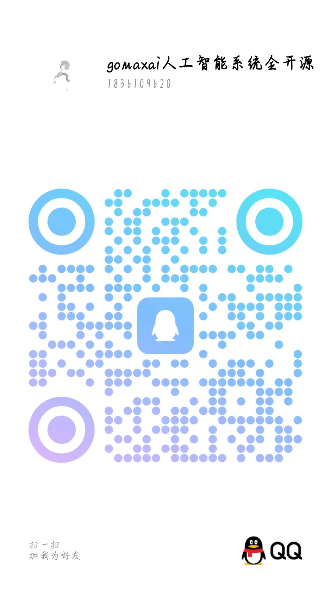

<h1 align="center">🍭  GoMaxAI-ChatGPT-Midjourney-Pro</h1>

全新精美的私有化AIGC平台(https://github.com/51yuese/GoMaxAI-ChatGPT-Midjourney-Pro)

## 产品介绍
- 本系统使用 Nestjs 和 Vue3 搭建的 AIGC 生态社区开发。数据库底层使用 MYSOL，WEB环境使用 PHP7.4 和niginx1.20.2，下面是简单功能个绍，还有更多细节无法一介绍，需要你自己下载并安装才能体验。
- 🔥 产品全功能介绍文档、部署教程等相关内容请https://w0760jamkm8.feishu.cn/wiki/BVQCwpPe9i4D1GkARfJcLqUNn9g?fromScene=spaceOverview查看。🔥 

## 演示站点
- [立即进入体验](https://gomaxai.qumao518.vip)

## 技术架构
- 前端：Vue3 
- 后端：Node.js
- 数据支持：MySQL5.7 + Redis

## 扫码获取
### 微信扫码
> 备注：AIGC咨询

### QQ扫码
> 备注：AIGC咨询

## 你需要准备
- 域名
- 服务器：建议配置2核2G5M带宽
- 对话模型平台API密钥（使用对话功能） 
- Midjourney会员订阅账户（绘画功能）
- 服务号（微信扫码登录使用）
- 其他模块（依据自己想法开启与否决定是否准备）：例如短信、邮件、微信支付等等

## 特性功能
- **极速部署：宝塔5分钟部署完成，低内存高并发；**
- **配置简单快捷：配置文件仅需数据库配置即可启动；**
- **对话模型支持：包括模型名称、别名、单次积分扣除数量等等；**
- **对话账号池（无限量）：支持OpenAI（所有模型、GPTS）、文心一言、清华智谱、讯飞星火等；**
- **支付功能:站点集成了微信官方支付，方便的易支付和码支付系统及第三方支付虎皮椒等；**
- **推广系统:站点集成了一级分销返佣功能，前端用户登陆后点击邀请好友赚取返佣，后台可只有开启关闭该功能；**
- **防洪链接:站点集成了域名跳板 以及QQ或者微信内部打开跳转浏览器的功能界面美观:站点完美支持PC端和手机端，支持手机电脑不同布局页面自适应；**
- **对接绘画:站点集成了Midjourney绘画，GPT绘画模型API。对接GPT:站点集成了GPT模型、百度千帆大模型、清华智谱大模型等；**
- **发卡系统:站点集成了发卡功能，自定义生成普通卡、引流卡密、套餐卡密。数据面板:站点集成了数据罗盘，实时监控流水，注册用户，付费用户等等；**
- **通知功能:站点集成了自定义网站客服、网站公告等等通知功能；**
- **密钥查询:站点集成了密钥一键查询功能；**
- **安全功能:站点集成了百度敏感词，及自定义违禁词功能；**
- **注册功能:站点集成了邮箱验证注册、微信扫码登录、手机号短信验证登录；**
- **角色扮演:站点集成了自定义调教人物脚本和，管理后台自定义添加，前台用户也可自定义添加属于自己的Prompt角色预设；**
- **内容安全多层过滤：内置词库 -> 自定义词库 -> 第三方（百度内容审核）安全检测，可同时启用**
- **支持邮件激活账号**
- **支持上下文对话**
- **精准统计绘画token、记录所有用户消费排行**
- **支持模糊匹配自定义回复消息**
- **支持按此按张按余额多种扣费方式**
- **支持套餐卡密生成及自定义卡密生成**
- **支持自定义配置发卡地址**
- **支持网站信息配置、名称、客服QV**
- **支持自定义邮件模板，发送定制化邮件内容**
- **支持自定义公告信息，支持md格式、html格式**
- **实时公告**

## 截图
> 截图非实时更新，实际请以演示站及最新版本的为准

### PC端浅色模式

### 移动端

### 后台管理
#### 控制台

#### AI绘画管理

#### AI绘画配置

#### 支付配置

用户配置

#### 动态菜单配置
